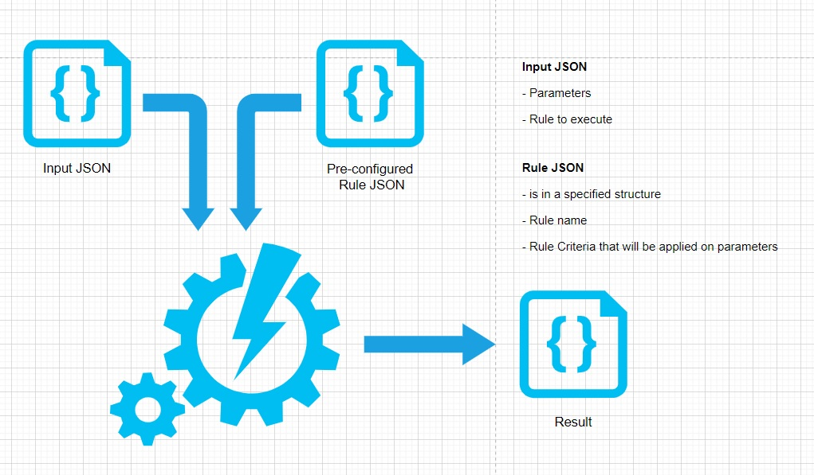

# RuleEngine
A simple, logical Rule Engine for Node.js, Browser and Salesforce LWC.



This Engine can perform logic that you can configure and let's you easily process the same on the input you provide. 

# Operators:

You can use following operators with RuleEngine to perform logic!
`"&&","||","!=","==",">" ,">=","<" ,"<="`

# Package Info:

This repo has 3 packages:
Node Package
Package for browsers
Package to implement with Salesoforce - Lightning Web Component framework (LWC)

# Get Started:

You'd find a working example for RuleBuider in the example module with each package, here's the description. Refer main.js/RuleBuilder js modules which are at the core of this library.

### Import RuleEngine and initialize:

`let myEngine = new RuleEngine();`

### Register pre-specified rules:

`myEngine.registerRule("mynamespace", rule);`   //namespace your rules to create group of rules

### Execute the Rules for your input:

`myEngine.execute(processMe).then((response)=>{  });`

### Here's how "processMe" would look:
```
let processMe = {
    ruleNameSpace : "mynamespace",                  //execute rules in this namespace
    executeAllRulesForSpecifiedNameSpace : true,    //if true, runs all rules in namespace, engine ignores "rulesToExecuteProperty"
    rulesToExecute : ["myrule"],                    //specify if you want to execute selective rules 
    inputs : {                                      //input parameters i.e. data to process
        param1 : 2,
        param2 : 3
    }
};
```

### A sample rule:

```
{
        ruleName : "myrule",                          //name of the rule
        returnVal : "custom value",                   //returns true if not specified, otherwise returns specified value when rule evaulates as "true" for input 
        formula : {                                   //specify formula here, which would be recursive
            operator : "&&",                          //for &&,|| operators, criteria should be an array of formulas 
            criteria : [
                {
                    operator : "||",                    
                    criteria : [
                        {
                            operator : "!=",           //for all other operators specify 
                            param : "param1",          //processMe.input[param] property name here to compare
                            value : 1                  //if comparing with constant, specify the value property
                        },
                        {
                            operator : "==",
                            param : "param1",
                            value : 2
                        }
                    ]
                },
                {
                    operator : "&&",
                    criteria : [
                        {
                            operator : "!=",
                            param : "param1",
                            value : null
                        },
                        {
                            operator : "!=",
                            param : "param2",
                            value : null
                        },
                        {
                            operator : "!=",
                            param : "param2",
                            compareWith : "param1"          //if comparing with one of the processMe.input[prop] properties, specify the property name in compareWith
                        }
                    ]
                }
            ]
        }
    }
```

### Here's the output:

```
var result = {
    "processMe": {                              //original input
        "ruleNameSpace": "mynamespace2",
        "executeAllRulesForSpecifiedNameSpace": true,
        "rulesToExecute": ["myrule"],
        "inputs": {
            "param1": 2,
            "param2": 3
        }
    },
    "outcome": {                                //outcome of the rules that were specified
        "myrule": "custom value"
    }
}
```

### Notes:

    - Output is immutable.
    - processMe and rule Schema must be as specified, if not, promise will be rejected.

### Well, that's all. Happy processing!
